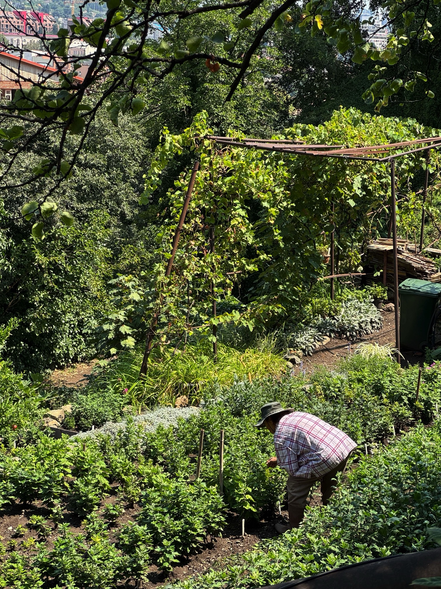

[После В.](/posts/2026/july) почти сразу в гости прилетела моя мама. Я опять работал, но по утрам и вечерам мы много ходили по городу, днём всё равно была жара, а мама её плохо переносит. Целую неделю мы ходили по нашему району, старому городу, Чугурети и другим местам, в ботанический сад, поднимались на Мтацминду, катались на фуникулёре и по канатной дороге, и много болтали о прошлом и будущем.

У Я. было день рождения, она собрала ребят кататься на мотоциклах в мотошколе. В подростковые года, у меня был мопед Карпаты и потом Иж Планета-5, всё думал, насколько я разучился управлять мотоциклами, но оказалось, что это как велосипед, никогда не разучишься. По началу было непривычно, но больше из-за веса, габаритов и того, как реагирует на управление сам мотоцикл, но к концу учебного часа я уже мог выкручивать руль до упора, чтобы сделать маленький круг вокруг конуса. Было весело.

Много ковырялся с проектами разными:

- У каталога с брендами появился [раздел с товарами](https://russianstreetwear.club/?view=products#products), там сейчас их уже около шести тысяч и только от восьмидесяти брендов (всего триста шестьдесят). Всё раскидывается по категориям автоматически, а что не получается, улетает в разное, а я потом руками прогоняю классификатор (Gemini 3.5 Flash) по фотографиям. Пока не понимаю, куда развивается сайт, но мне прост весело всем эти заниматься.
- Сделал нового телеграм-бота, [AnyDoc Bot](https://t.me/anydoc_to_md_bot). Принимает почти любой документ или изображение, и возвращает маркдаун. Воспользовался сам пару раз для реальной нужды, но по статистике кто-то ещё начал пользоваться тоже. Тоже без понятия, зачем это всё, просто было весело с клодом поковыряться и сделать.
- Сделал сайт (игру?) [Всесоюзного научно-исследовательского института слова](https://vniislov.xyz/), где нужно обнаружить все слова русского языка. Я когда-то наткнулся на [World Reasearch Inc.](https://wordresearch.xyz/) и захотел его локализовать, вроде, получилось и даже со своими особенностями. Писал о нём в телеграм-канале: [тут](https://t.me/nuril_notes/199) и [тут](https://t.me/nuril_notes/201). Как вы догадались, смысла тоже никакого, мне просто весело, задаваться вопросам «а зачем?» в целом надо поменьше в этом деле.
- Добавил [гостевую книгу](https://baradusov.ru/postcard) на свой сайт, тоже писал об этом, [в канале](https://t.me/nuril_notes/203). Прелесть личного сайта в том, в отличии от соцсетей, что с ним можно делать всё, что угодно и (опять) не особо задаваться вопросом правда ли это надо. Вот думаю, добавить на сайт сторизы (шучу). Ещё кажется, что мой сайт недоступен в России. Пока не понял, что с этим делать и нужно ли что-то делать.

Купил себе Kindle Paperwhite. У меня когда-то уже был PocketBook, и мне было с ним очень удобно. Но потом долгое время я читал с телефона, но с телефона мне всегда было сложно читать, потому что он меня легко отвлекает другими забавами. Настолько сложно мне читать с телефона, что я почти перестал это делать. А бумажными книгами с переездом в другую страну пока себя останавливаю закупаться (очень много отговорок, да). Сначала я хотел купить Boox Go 7, но в одном магазине он исчез, а в другом был только белого цвета. Я совсем не хотел киндл из-за привязки к амазону, но потом я узнал (прямо перед витриной в магазине), что его можно просто джейлбрейкнуть, отрубить обновления и поставить туда кастомную читалку KOReader, решил взять его. Пользуюсь третий день на момент написания поста и очень доволен. Может быть, хорошо, что не купил Boox, потому что он на андроиде. Наконец-то дочитаю Мост на Дрине, которую начал ещё [в июне](/posts/2026/june).

И под конец странное-удивительное: в твиттере один иностранный графический дизайнер выложил фантик китайской конфеты, и написал, что красиво, я согласился с ним и сохранил себе фото. Н. в это время улетала домой во Владивосток, и по возвращению спросила, что привезти, а я в шутку отправил ей фото фантика и сказал, что вот эти конфеты. А она взяла и привезла их!
