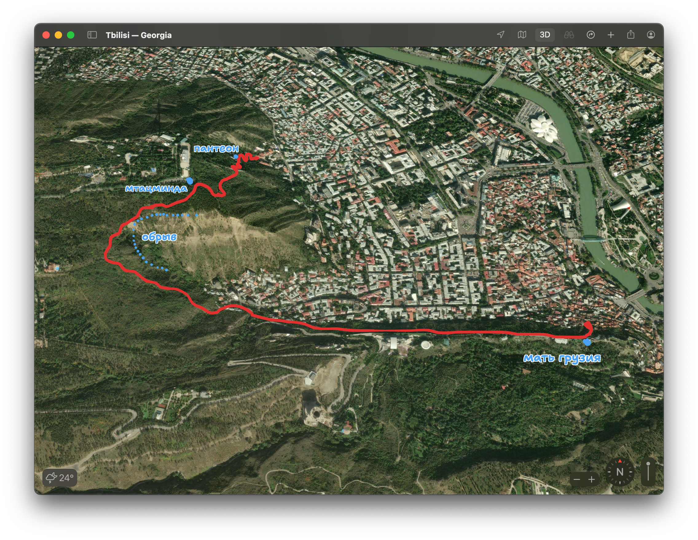

Ходили с ребятами в небольшой городской хайкинг. Немного прогулялись по городу, а потом поднялись пешком к Пантеону, оттуда по лестнице до Мтацминды, а оттуда по брущатчатой дорожке до Матери Грузии. Тропа лайтовая, потому что не надо идти по земле, но при этом это одно и самых хороших мест для хайк-прогулочки.

Прилетала в гости В. Невероятно рад был повидаться. Мы много куда ходили и гуляли по городу, я старался как-то всё соместить с работой и, вроде, даже удалось. Больше всего времени провели, конечно, блуждая по городу и по барам, но а также съездили все вместе (я, Я., В., Ф. и Н.) в ущелье Хада. Оказалось, что рядом стройка тоннеля. О нём мы слышали, но не знали, что строительный маршрут проходит через ущелье и что через него ездит много грузовиков. Ущелье само красивое, но грузовики...

Сходили ещё посмотреть на мост Нацубидзе, это три панельных дома, которые соединены между собой мостами. С одной стороны можно зайти на мост с улицы, а с другой надо подняться на четырнадцатый этаж. Относительно недавно эти мосты были чуть ли в аварийном состоянии, но в 2025 году их отремонтировали. Чтобы подняться на четырнадцатый этаж, надо опустить двадцать тетри, а чтобы заполучить их, можно обменять деньги у хранительницы лифта Мзиа Сабанадзе. Что мы и сделали, и она нас пригласила на рассказ про эти жилые дома и мост (мы согласились и просидели у неё минут сорок). В подъезде на стенах висят разные постеры фильмов, которые про неё сняли, и про неё писал, например, [The Guardian](https://www.theguardian.com/global-development/2024/apr/29/cats-cuddly-toys-and-a-portrait-of-stalin-the-lift-lady-guarding-tbilisi-brutalist-skybridge).

В честь полугода жизни в Тбилиси написал пост про [город](/posts/2026/tbilisi). Постарался описать свои переживания по поводу города, из которых строится моё отношение к нему, а не очередной гайд переезда или куда сходить.

Июль вышел короткий. Помимо того, что описал, просто много работал.
