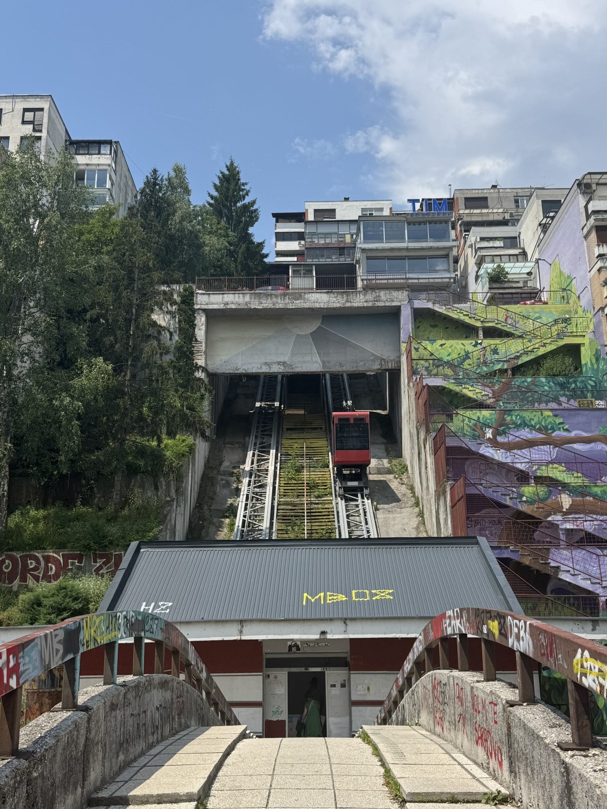
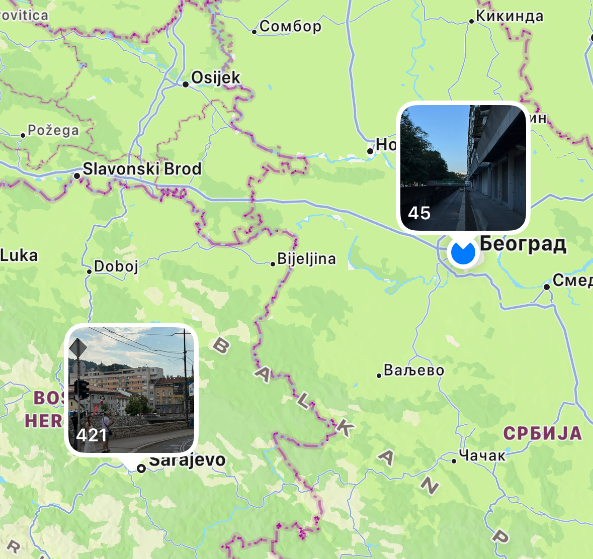

Тяжело что-то писать, не знаю, почему. Иногда кажется, что даже заставляю себя. Но, наверное, дело в том, что формат поста в блоге предполагает больше текста, чем у меня выходит последнее время. Или я стал слишком сильно фильтровать, что хочется рассказать, а чего не хочется. Такое, конечно, лучше не делать и дампить мысли. А потом уже фильтровать. Ну или просто мало чего происходит. Вот такие раздумия. Энивэй, вот что было в июне.

Я наконец-то стабильно хожу на болдеринг. В июне я проходил аж по три раза в неделю ради эксперимента, выбирая разные дни. Всё ещё не получается, как когда-то к девяти утра приходить, но к 10:30 уже хорошо. Всё сильно зависит от того, насколько поздно ложусь спать. Вообще режим сна сложно восстанавливать. Мой способ это не только ложиться раньше, но и стабильно заставлять себя просыпаться рано. Обычно через неделю организм уже в одинадцать ночи начинает проситься спать из-за этого. Надо пытаться отлавливать это и поддаваться. Так вот, скаладром мне всё ещё не нравится, но болдеринг-то я люблю, смешанные чувства сильно испытываю, потому что иногда не хочу идти туда. После болдеринга я обычно добирался до офиса, и так вот июнь выше очень богат на выход из дома, что сильно радует.

Наши дорогие и любимые друзья Ф. и Н. сыграли свадьбу! И мы были свидетелями этого потрясающего события. Была полноценная торжественная часть в Доме Юстиции, потом мы прогулялись по паркам вокруг, ребята нам выдали одноразовые плёночные камеры, чтобы фотографировать всё, что душе угодно в этот день. Подумал, что такая камера сильно придаёт уверенности в результате, потому что ощущение, что на плёночную мыльницу, тем более одноразовую, никак не получится сделать плохую фотографию. Потом мы ещё прогулялись по городу, посидели в ресторанчике с грузинской кухней и отправились по домам. Был важный и волнующий для наших друзей (да и нас) день, день рождения новой семьи!

Потом я улетел в одиночный отпуск на неделю в Сараево и Белград. Из Тбилиси в Сараево нет прямых рейсов, летел через Стамбул с пересадкой полтора часа. А из Сараево в Белград прямым рейсом, который длился сорок минут. И обратно в Тбилиси из Белграда тоже прямым рейсом. Сараево мне понравился как туристический город, но там я влюбился в район Циглане с его ландшафтом, архитектурой и лифтом-фуникулёром.

Белград же мне понравился как потенциальный город для жизни, а как туристу там мало чего привлекательного. Помимо знаковых зданий совмодернизма, там есть район Новый Белград, который показался интересным только как воплощение идей идеального города, но блуждая между блоками-кварталами, какой-то жизни я там представить не смог. Центральные же районы устроены плотно с неширокими улицами и кварталами, между которыми приятно дрейфовать.

Чуть яснее впечатления описал [в телеграм-канале](https://t.me/nuril_notes/196):

> 
>
> я тут в мини-отпуске, был в Сараево пару дней, а сейчас в Белграде столько же
>
> Сараево, как по мне, намного красивее и аккуратнее, чем Белград
>
> в какой бы части города не был (а я бывал и на окраинах, и в частных секторах, не только в туристическом центре), там всегда хотелось что-то сфотографировать, хоть это исторические османские постройки, хоть это социалистический югославский спальник, хотелось всё разглядывать в деталях
>
> в Белграде же, кроме заметных символов соцмодернизма, ничего сильно не привлекало внимание, но в плане городского устройства центральных и около районов, плотной застройки и возможности блужданий по ним, мне понравилось больше
>
> при этом в Сараево я не увидел ни одного нефора, а это один из признаков прогрессивности города, наравне со спешалти кофейнями, которых в Сараево тоже нету

В отпуске было так хорошо, а после отпуска стало плохо. Постотпускной блюз, синдром, депрессия, хандра — всё вот это вот происходило несколько дней, для отпуска одной недели недостаточно было, но сейчас лучше, уже думаю о том, когда и куда следующий отпуск организовать.
