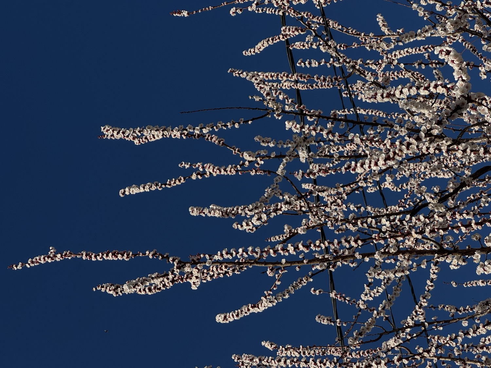

Много работал, мало чего происходило. Да ещё и болел. Мало, но сильно, целые выходные и понедельник, а потом ещё чувствовал себя очень погано всю неделю. Пытался вспомнить, как обычно, по фотографиям, что произошло за месяц, а там одни скриншоты, сохранённые мемы, рассыпанные макароны в раковине и убирающийся робот-пылесос. А да, купили робот-пылесос. Чудо техники, когда у тебя квартира приспособлена к этому, и особенно, когда пылесос моющий.

По инерции от февраля занимался всякими своими проектами и экспериментами, но к середине месяца запал пал. Опять вспомнил, что проекты это вторая работа, за которую не платят. А ещё опять напомнил себе, что делать параллельно много всего сложно, потому что ничего не двигается нормально вперёд и лучше сконцентрироваться на одной-двумя вещами.

В Тбилиси заезжали Ж. и М. по пути из своего отпуска где-то в горах. Рад был видеть! Где-то гуляли, ели-пили, и вытащили меня на болдеринг. А я на скаладроме не был с самого отъезда из Санк-Петербурга, почти три месяца. После пары раз на болдеринге снова почуствовал, что у меня, оказывается, есть тело. Но после такого перерыва тело совсем не слушается, хоть голова понимает, какие движения надо делать.

Короткий месяц выдался.
