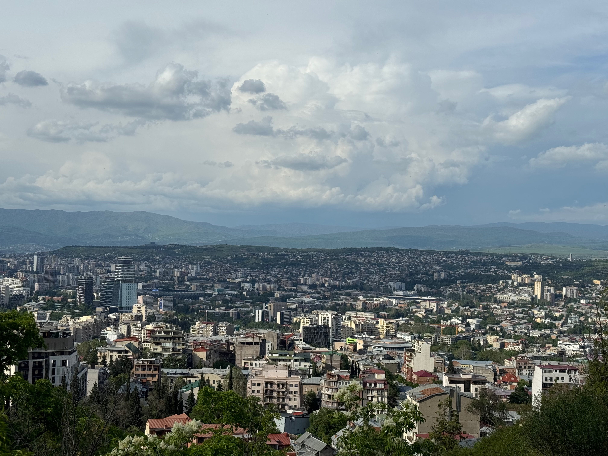
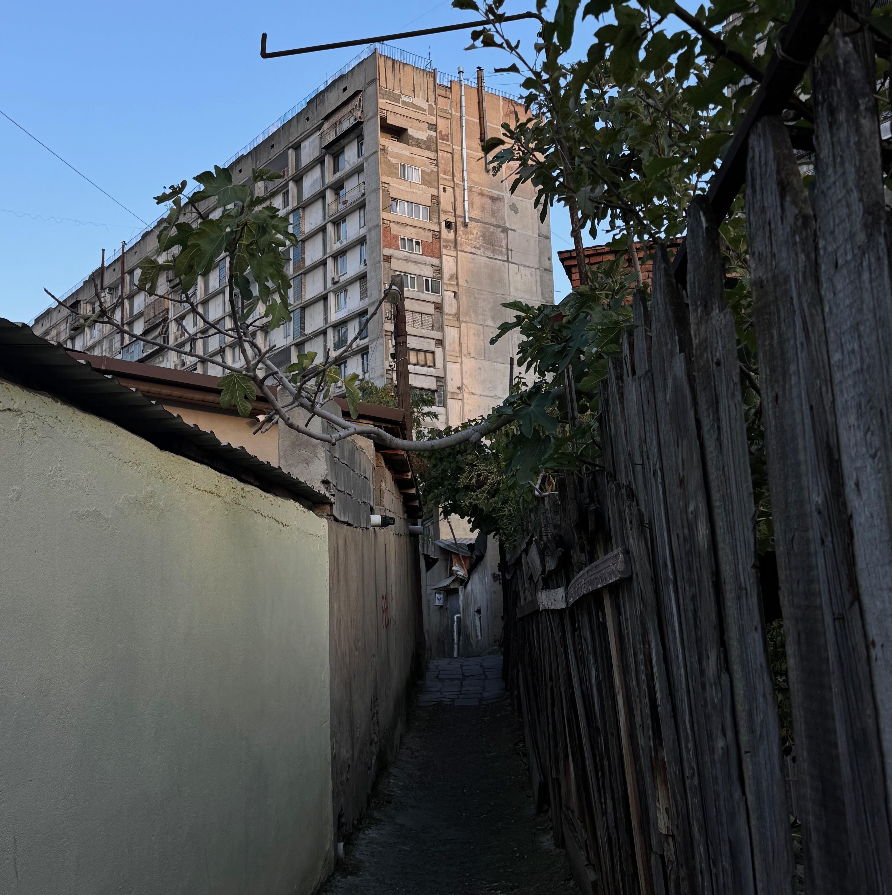
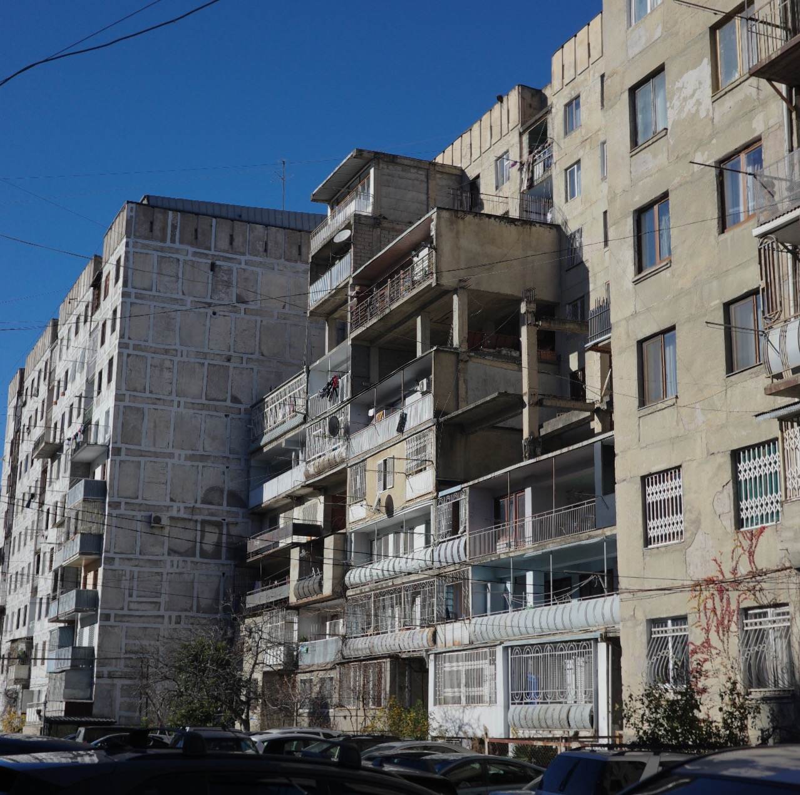
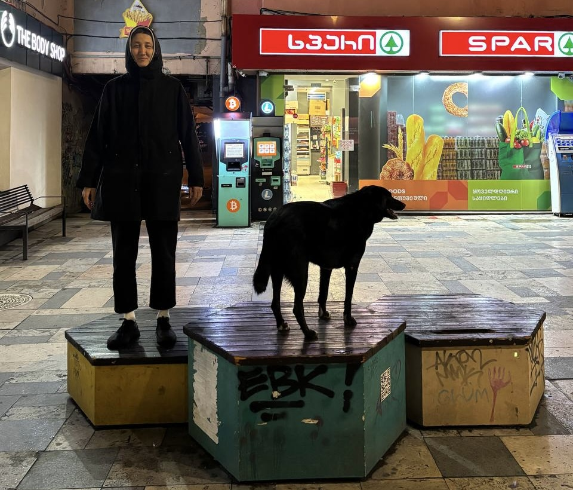

Прошли полгода, как мы с Я. переехали в Тбилиси. За такой период времени вряд ли можно полноценно познать любой город. И-Фу Туан, например, писал, что абстрактное знание о месте приобретается быстро, а ощущение места складывается долго из мимолётных повторяемых переживаний. Попробую эти короткие неполноценные переживания и зафиксировать.

---

Начать, думаю, стоит с того, на чём строятся самые искренние разговоры между людьми, потому что это влияет и волнует каждого. Погода.

Я прилетал в Тбилиси на неделю в октябре прошлого года, а окончательно переехали мы в декабре, застали почти все сезоны. С первым приездом мне повезло с погодой, было около двадцати градусов и почти всю неделю светило солнце, но оно уже не было таким летним, и все дни я проходил в худи или флиске. Уже не помню, были ли дожди за эту неделю, но вот смотрю сейчас на архив погоды, и в октябре в целом было от силы несколько дождливых дней.

Декабрь был тоже преимущественно солнечный, весь месяц проходил в кофте и плаще, иногда шли дожди или мимолётный снег, а температура была около десяти градусов, опускаясь до нуля или чуть ниже по ночам. Первый крупный снег пошёл в середине января, но в этом и следующем месяце, феврале, температура держалась в районе от минус пяти до плюс пяти, и если и шёл снег, то это всё по большей части превращалось в снежную кашу без грязи. Но в январе снежная погода продержалась неделю, потом ещё неделю в феврале. Эти два месяца уже были заметно холоднее, но зимнюю куртку я так и не достал и проходил в флиске, а поверх накидывал худи и плащ, чтобы в любой момент можно было что-то снять и убрать в сумку. Ещё всё зависит от района, потому что город расположен то на холмах, то в низинах, и если подняться в район повыше, то там уже можно застать сохранившиеся снежные островки, а если подняться ещё выше на Мтацминду, то можно прогуляться по снегу и полюбоваться замёрзшим озером.

В феврале и марте было уже чуть меньше солнца, либо сплошная серость, либо крупные кучевые облака. В марте температура вернулась к десяти-пятнадцати градусам, но усилился ветер, иногда настолько сильный, что ходить по улице становится неприятно, а иногда опасно из-за падающих веток и деревьев. Городские телеграм-каналы хором называют этот месяц _гижи марти_ («сумасшедший март») из-за непредсказуемой погоды.

Местные таксисты говорили, что это была самая холодная весна, а если посмотреть на историческую погоду, то так плюс-минус последние лет пять. Но это бездушные графики, а то — ощущение людей.

В апреле уже чувствовалась весна, та, которая пригревает теплом и поднимается настроение из-за чувства приближения лета, но немного чаще идут дожди. Ну а в мае уже вовсю расхаживал в футболке и рубашке. К концу месяца, правда, дожди усилились, было много ливней и потопов, шли они преимущественно ночью и чуть ли не каждый день, и так по самую середину июня, а днём снова бывала окололетняя погода. Те же городские телеграм-каналы всё так же хором шутили про бесконечные дожди и задавались вопросом, когда же это закончится, словно это редкое явление для тбилисской весны.

Переезд в место с тёплым климатом и правда может влиять на настроение, а может быть дело в том, что зимы в европейской части России некомфортные по большей части не из-за температуры и снега, а из-за того, что сильно сложно передвигаться по тротуарам и велодорожкам, потому что, оказавшись в беззимовье, ловил себя на желаниях хоть немного потоптать снег.

---

Тбилиси большей частью врезается в Триалетский хребет, а в самом центре города находится географическая достопримечательность, гора Мтацминда. Из-за своего расположения город имеет интересный ландшафт: восточная часть лежит в низине, на севере и юге городские районы залезают на холмы, западная часть активно застраивается и всё дальше заходит в ущелье хребта, восточную и западную часть разделяет река Мтквари, а север и юг разрезают река Вере и гора Икалто, на которой расположены большое кладбище, недостроенный центральный парк и район, соединяющий спальник с центром.

Чтобы попасть в центральные районы на транспорте, есть три пути: через низину вдоль реки Мтквари, через тоннель под Икалто или над Икалто через перевал. Без транспорта можно пройти по тем же путям, кроме тоннеля, и ещё через тот район, расположенный на горе Икалто. Перевал и низина для меня скучные, но быстрые пути, где ты идёшь по широким улицам с кучей автомобилей. Через горный район же путь самый лестничный и запутанный, с узкими улочками, частными домами среди панелек, что мне сильно в нём и нравится.

Лестниц и улочек тут вообще предостаточно из-за ландшафта. Возможно, это моя самая любимая часть города, для изучения которой я много времени провёл в уличных экспедициях в поисках неочевидных пролазов из одной части в другую и соединения всего этого в маршруты для импровизированного городского хайкинга.

Для меня-пешехода всё это восторг, но для меня-велосипедиста уже так город не поизучать. Хотя я тут всё ещё без велосипеда, не могу представить, как тут можно комьютить-блуждать, кроме как по большим улицам, это не для меня, даже с велодорожками.

---

Много автомобилей. А может так кажется. А может везде так. Но они тут теснят обычных смертных пешеходов и любителей автобусов и поэтому не могу это пропустить. Они тут массово паркуются на тротуарах, из-за чего на небольших улицах легче идти по дороге, здесь с непривычки страшно (да и сейчас бывает) переходить бессветофорные переходы, потому что никто не пропускает и не притормаживает, тут у реки Мтквари нету набережной, потому что отдано под скоростные автомобильные улицы, а тротуары иногда неожиданно обрываются автозаправкой, через которую надо пройти, чтобы пройти дальше.

Но зато здесь дешёвый проезд на общественном транспорте (один лари) и выделенные полосы под него, а у каждой остановки есть табло со оставшимся временем до прибытия автобуса. Ездить на нём приятно. Из-за выделенок таксисты тут, бывает, любят останавливаться прямо на второй полосе, и приходится, оглядываясь и по команде таксиста, выбегать из машины посреди дороги, чтобы добраться до тротуара.

Ещё здесь много электрокаров. Как я понял, в прошлом году из всех новых машин около тридцати процентов зарегистрированных были электрокары и гибриды. Связано это с тем, что в Грузии не надо платить акциз на ввоз электромобилей, и для растаможки есть большая скидка. Тесла тут уже давно не удивляет.

---

Тут много самостроя. Не отдельного, а именно пристроек, чаще всего, к хрущёвкам или панельным домам. Это может быть просто небольшая пристройка на первом этаже или расширенный балкон, а может быть целый дополнительный этаж на весь дом или расширение всех этажей дома, которое на первый взгляд можно и не приметить. Называется такой феномен «[მიშენება](https://um.ge/news/tbilisis-mishenebebi)» (мишэнэба), на русский ближайший перевод, наверное, пристройка. Появляться начали они после развала советского союза, исчез контроль, денег на новое жильё не было, хрущёвки не вмещали семьи, и люди расширяли жилплощадь как могли.

В 2007 году вышел закон, который запрещает новые пристройки и узаконивает текущие. Скорее всего поэтому, в сочетании с нехваткой самофинансирования, среди самостроев много недостроев. Выглядит это всё часто впечатляюще, но уродливо.

---

В Тбилиси много бездомных собак. По более-менее [актуальным источникам](https://www.france24.com/en/live-news/20251205-georgia-s-street-dogs-stir-affection-fear-national-debate) их насчитывается около тридцати тысяч. У подавляющего большинства есть клипса на ухе, которая означает, что собака была поймана, стерилизована, привита и отпущена ([TNVR](https://en.wikipedia.org/wiki/Trap%E2%80%93neuter%E2%80%93return)). Бездомных собак тут никто не боится, все их подкармливают, балуют и не прогоняют. Собаки могут лежать в кофейнях, парикмахерских, банках, многие из них по сути не бездомные, а дворовые собаки.

Но иногда эти собаки могут проноситься большой стаей, лая на других собак, или толпой идти за тобой до самого дома, или приставать и выпрашивать еду, а по рассказам могут и напасть.

---

Тут много японцев. Ну как много, по [официальным данным](https://www.mofa.go.jp/region/europe/georgia/data.html) на конец 2024 года в Грузии живут двести японцев. По словам Хироши, в ресторанчик которого мы изредка ходим у нас на районе, тбилисская диаспора состоит примерно из четырёхсот японцев, а вот [японский блогер](https://ca-voir.com/why-you-should-be-based-in-batumi-jp/), живущий в Батуми, пишет, что их в стране около пятисот.

Я же могу судить только по количеству заведений, которые держат чисто японцы. Мне известно как минимум семь таковых, и одна японка, которая занимается стрижкой.

Связано это всё с тем, что Грузия чуть ли не единственная страна, которая позволяет японцам находиться без визы целый год. Плюс Грузия известна лёгкостью открытия бизнеса и низким налогом на ИП малого статуса. Если верить тому же блогеру из Батуми, то до 2017 года здесь жили где-то десять человек, а потом произошёл бум, такой, что у японцев тут своя микро-экономика теперь. Вот, например, [каталог с японцами](https://locotabi.jp/georgia-grz), которые предоставляют разные услуги в Грузии.

---

Всё это не описывает полноценно город, а только то, что сильно въелось в мою голову. И если бы меня через несколько лет спросили, как мне было в Тбилиси, то скорее всего вот такой бы опыт всплыл из моей памяти (а теперь и ссылку можно скинуть).
